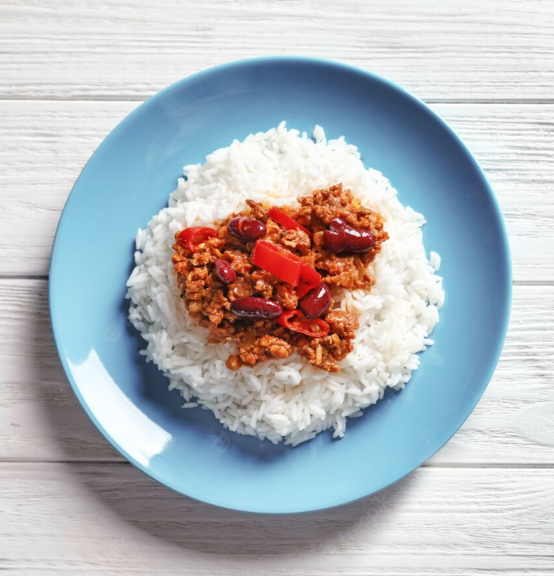

# Chili con Carne de la Nescher (2 bis 3 Portionen)

## Zutaten
* 500g gemischtes Hackfleisch
* 1 Dose Kidneybohnen
* 1 Dose Mais
* Salz
* Pfeffer
* 2 Chili-Schoten
* 700ml passierte Tomaten
* Öl (Olivenöl / Rapsöl / etc.)
* 2 Zwiebeln
* 1 bis 2 Knoblauchzehen

## Werkzeugkasten
* 1Topf
* 1 Messer
* 1 Brett
* 2 Schüsseln

## Zubereitung
> Für die Zubereitung ist das kurze [Video](https://www.youtube.com/watch?v=EEdBU64dYzw) von [Steffen Henssler](https://de.wikipedia.org/wiki/Steffen_Henssler) ratsam.
 

1. Das gemischte Hackfleisch in den Topf, in welchem sich 2 EL Öl befinden, mit dazugeben.
2. Während das Hackfleisch brät:
    * Die Zwiebeln in kleine Stücken schneiden.
    * Die Knochblauchzehe(n) andrücken und ebenfalls in kleine Stücken schneiden.
    * Die Chili-Schoten in kleine Stücken schneiden.
3. Wenn das Hackfleisch durchgebraten ist und relativ wenig Wasser im Topf übrig ist, die in Stücke geschnittenen Zutaten mit in den Topf dazugeben.
4. Die Zutaten mit dem Hackfleisch zusammen noch etwa 1 Minute kochen lassen.
5. Kräftig mit Salz und Pfeffer würzen.
6. Nun werden die passierten Tomaten mit hinzugegeben und zusammen mit dem Hackfleisch und restlichen Zutaten 10 Minuten auf kleiner Flamme köcheln lassen.
7. Während des Köchelns können folgende Dinge vorbereitet werden:
    * Schüssel mit Mais
    * Schüssel mit Kidneybohnen
8. Die beiden Schüsseln werden nach den 10 Minuten mit hinzugegeben und etwa 2 Minuten mit gekocht. 

## Resultat
